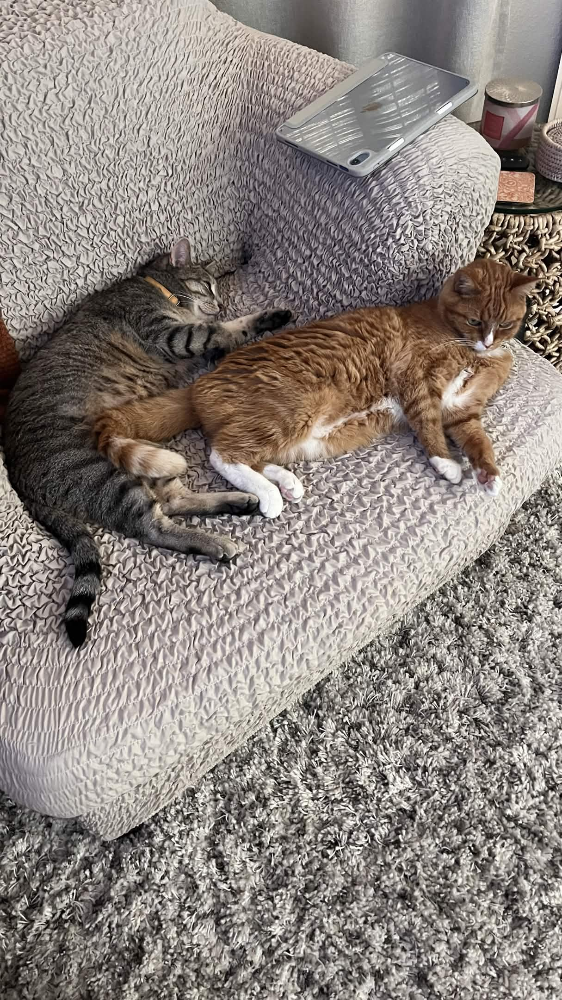
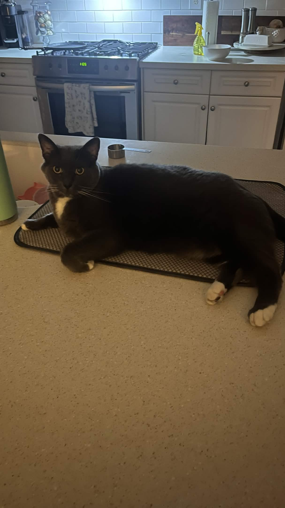

# **Welcome to My Page!**
## By Ethan Managbanag

My [GitHub](https://github.com/ethanbanag)
My [Projects](pages-docs/projects.md)

## Table Of Contents
### [About Me](#about-me)
### [Languages/Frameworks I Know](#languagesframeworks-i-know)
### [Some Fun Facts](#some-fun-facts)
### [Some Future Goals](#some-future-goals)
### [My Weekly Goals](#my-weekly-goals)
### [A Favorite Quote of Mine](#a-favorite-quote-of-mine)

### About Me 
Hi my name is Ethan Managbanag, I am currently a second-year student at UCSD studying Computer Science. I hope you enjoy my page!

## Languages/Frameworks I Know
- 'Python'
- 'Java'
- 'JS'
- 'C#'
- 'C++'
- 'C'
- 'React'

### Some Fun Facts
- I love rock climbing
- My favorite show is Invincible
- I have 3 cats (see below)

### Some Future Goals
1. Graduate and find a full-stack job
2. Have my own place (likely renting)
3. Travel around the world

### My Weekly Goals
- [x] Create a web page on my GitHub
- [ ] Do homework for PHIL 27
- [ ] Catch up on shows

### A Favorite Quote of Mine
> <ins>"Don't water dead flowers"</ins>
This is one of my favorite quotes to live by as it shows not to dedicate/invest a lot of time into things that are already over.

